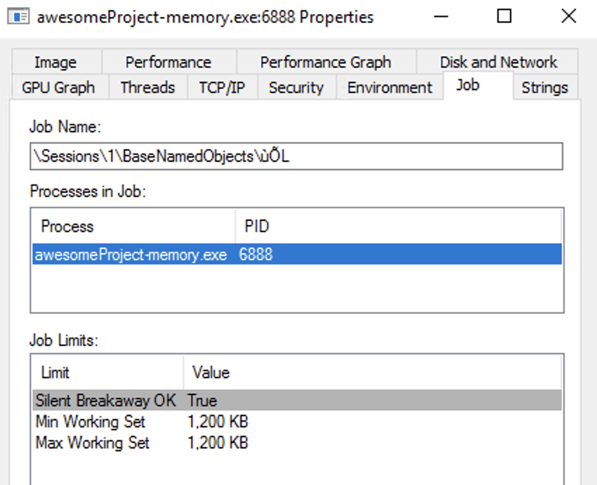

## golang-windowsprocess

This library supports managing Windows Processes from Golang.

## Why?

Job Objects are kinda like CGroups but for Windows - allowing you to throttle the CPU/Memory limits for a given pool of processes. This library makes Job Objects usable from Golang.

## Technical Notes

This is achieved by using [Job Objects](https://docs.microsoft.com/en-us/windows/desktop/ProcThread/job-objects) to assign Limits to a Process. It's planned to support both Memory and CPU limits on a Job Object - however at this time only Memory limits are supported.

Once a process has been assigned to a given Job Object - it cannot be assigned to another (this'll instead crash the process).

Job Objects can be seen using [Process Explorer](https://docs.microsoft.com/en-us/sysinternals/downloads/process-explorer):



## Example Usage

```go
jobObject, err := jobobjects.Create("Example")
if err != nil {
    panic(err)
}

err = jobObject.ConfigureMemoryLimits(1200, 1200)
if err != nil {
    panic(err)
}

processId := 5660
err = jobObject.AssignProcess(processId)
if err != nil {
    panic(err)
}
```

## Licence

MIT